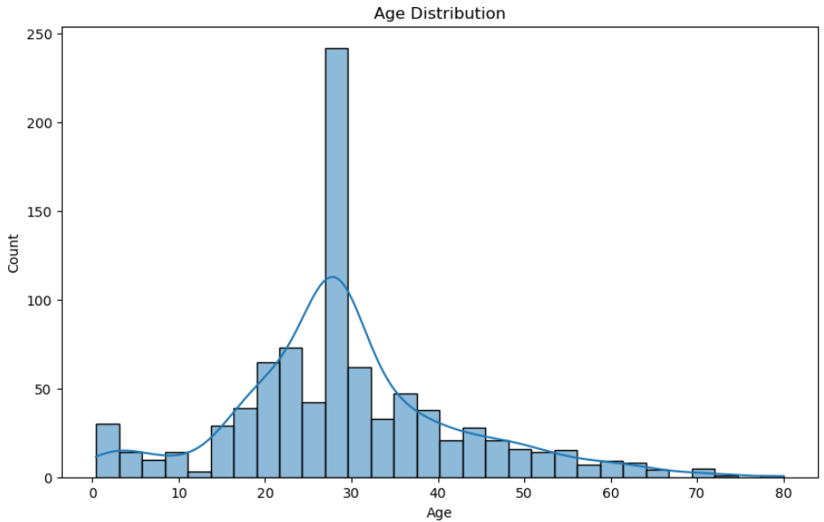
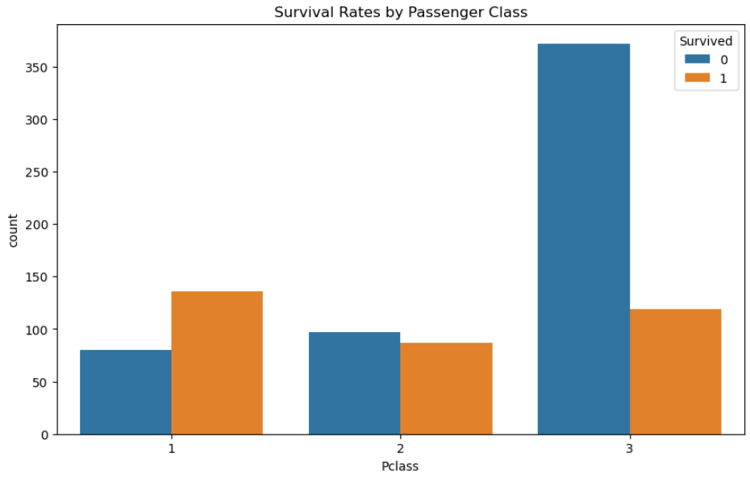
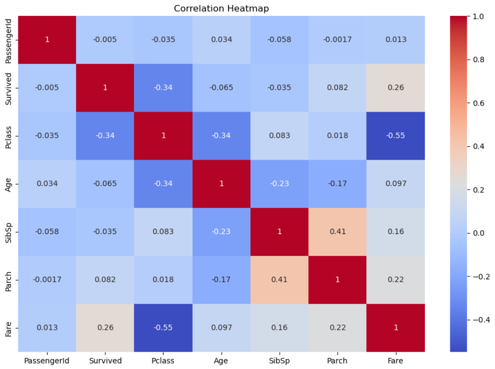

# Titanic Data Science Project

This repository demonstrates a complete data science workflow using the Titanic dataset. It is designed as a practical example to showcase data science methods and processes, from data cleaning and feature engineering to data visualization and model building. This project serves as a demonstration of key concepts in data science, and can be presented as a portfolio piece to illustrate your proficiency with data analysis and machine learning.

## Repository Contents

- **`titanic_data_analysis.ipynb`**: The Jupyter Notebook that contains all the steps of the data science process, including data cleaning, exploration, visualization, feature engineering, and model building.
- **`./images/`**: A directory containing visualizations generated during the analysis.

### Project Overview

The project aims to predict the survival of passengers on the Titanic using various data science techniques. The dataset is sourced from the well-known Titanic dataset, which includes details such as passenger age, sex, ticket class, and whether they survived.

#### Steps in the Notebook:

1. **Importing Libraries**: Essential libraries like `pandas`, `numpy`, `matplotlib`, and `seaborn` are imported for data manipulation and visualization.

2. **Downloading and Loading Data**: The Titanic dataset is downloaded from a remote URL and loaded into a pandas DataFrame for analysis.

3. **Initial Data Exploration**: Basic exploration of the dataset is conducted, including displaying the first few rows, checking for missing values, and summarizing numerical columns.

4. **Handling Missing Values**: Missing values are addressed by filling them for certain columns (like 'Age' and 'Embarked') and dropping others (like 'Cabin').

5. **Encoding Categorical Variables**: Categorical variables such as 'Sex' and 'Embarked' are converted to numerical format using one-hot encoding to prepare the data for machine learning models.

6. **Data Visualization**: Various plots are generated to explore the data, including:
   - **Age Distribution**: A histogram of passenger ages.
   - **Survival Rates by Passenger Class**: A count plot showing survival rates across different passenger classes.
   - **Correlation Heatmap**: A heatmap showing correlations between numerical features.

   
   
   
   
   

7. **Feature Engineering**: New features such as 'FamilySize' and 'IsAlone' are created to potentially improve the model's predictive power.

8. **Preparing Data for Modeling**: The data is split into features (`X`) and target (`y`), and then further split into training and testing sets for model evaluation.

9. **Modeling with Random Forest**: A Random Forest classifier is built and evaluated using a confusion matrix and classification report to measure its performance.

### Purpose

The primary purpose of this repository is to demonstrate a typical data science workflow with a practical example. It also serves as a portfolio project to showcase your skills in data analysis, feature engineering, visualization, and machine learning.

### How to Run

To run the notebook:
1. Clone the repository to your local machine.
2. Ensure you have Jupyter Notebook or Jupyter Lab installed.
3. Open `titanic_data_analysis.ipynb` in Jupyter Notebook.
4. Follow the steps in the notebook to replicate the analysis.

### Contributing

Feel free to fork this repository, open issues, and submit pull requests. Your contributions are welcome!

### License

This project is licensed under the MIT License - see the [LICENSE](LICENSE) file for details.

